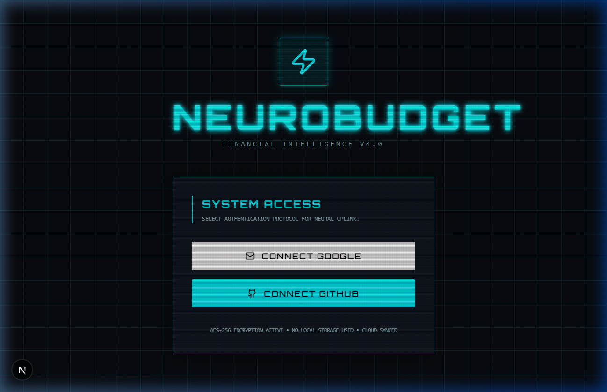
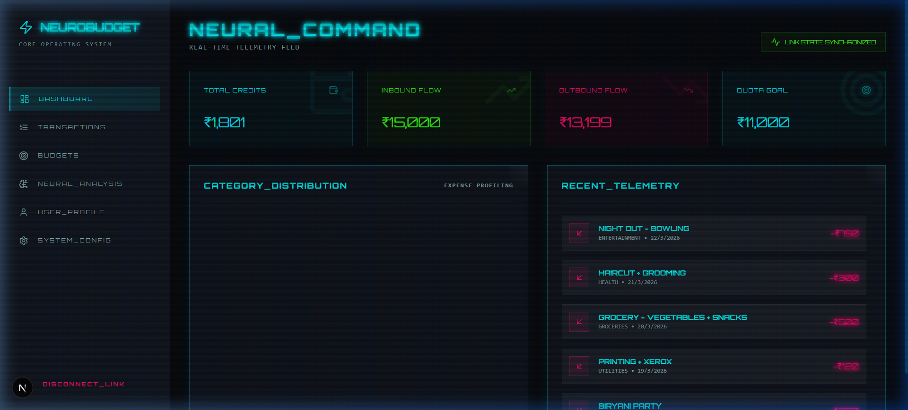
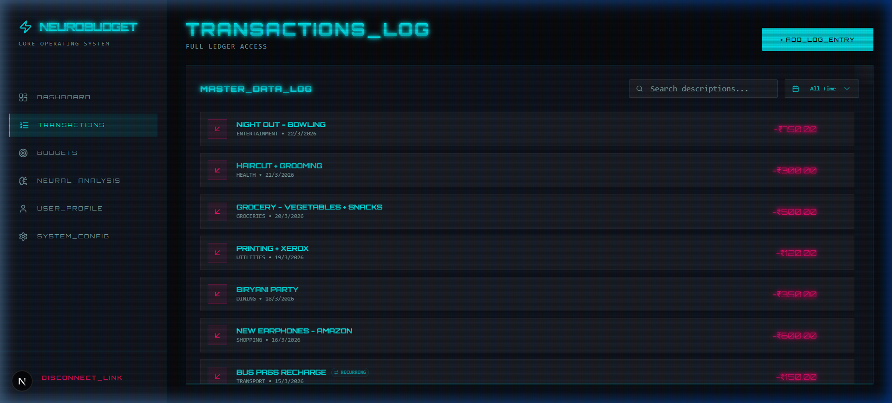
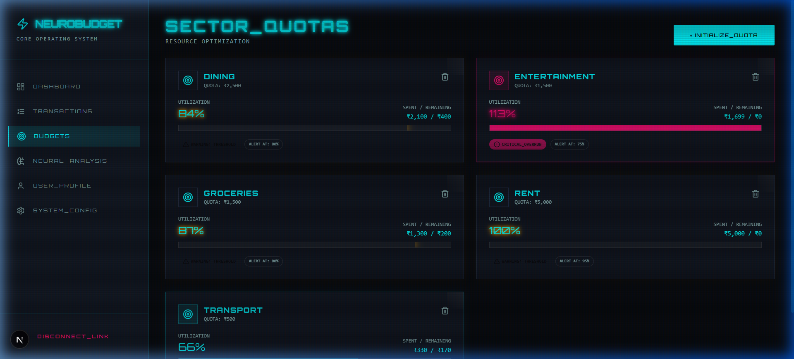
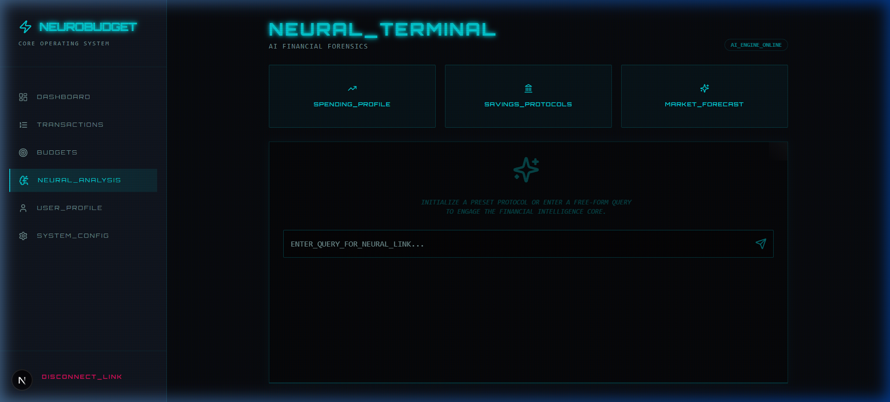

<p align="center">
  
</p>

<h1 align="center">⚡ NeuroBudget</h1>
<h3 align="center">Cybernetic Financial Intelligence System</h3>

<p align="center">
  
  
  
  
  
</p>

<p align="center">
  A next-generation personal finance tracker with a <strong>cyberpunk-inspired UI</strong>, <strong>real-time cloud sync</strong>, and <strong>AI-powered financial insights</strong> — built for those who take their money seriously.
</p>

---

## 🎯 Overview

**NeuroBudget** isn't your average budgeting app. It combines the power of Firebase's real-time database with **Google Gemini AI** to give you actionable financial intelligence — all wrapped in a sleek, terminal-inspired cyberpunk interface.

Track income and expenses, set budget quotas with threshold alerts, and let the **Neural Analysis Engine** identify spending patterns, savings opportunities, and financial forecasts.

---

## ✨ Features

### 🖥️ Neural Command Dashboard
> Real-time financial telemetry at a glance

- **Live stat cards** — Total Credits, Inbound Flow, Outbound Flow, Quota Goal
- **Category Distribution** — Interactive pie chart of spending categories
- **Recent Telemetry** — Latest transactions feed with type indicators

<p align="center">
  
</p>

---

### 📊 Transactions Log
> Full ledger access with search, filter, and CRUD operations

- Add income/expense entries with custom categories
- **Search** by description, **filter** by month
- Visual indicators for **recurring** entries
- One-click delete with hover reveal

<p align="center">
  
</p>

---

### 🎯 Sector Quotas (Budgets)
> Resource optimization with real-time utilization tracking

- Set **spending limits** per category with customizable **alert thresholds**
- Live **progress bars** showing utilization percentage
- **Color-coded alerts**: 🟢 Stable → 🟡 Warning → 🔴 Critical Overrun
- Real-time spent vs. remaining calculations

<p align="center">
  
</p>

---

### 🧠 Neural Analysis (AI-Powered)
> Financial intelligence powered by Google Gemini

- **Spending Profile** — AI breakdown of your spending patterns
- **Savings Protocol** — Personalized savings recommendations
- **Market Forecast** — Predictive financial analysis
- **Custom Queries** — Ask anything about your finances in natural language
- Risk-level assessment with actionable recommendations

<p align="center">
  
</p>

---

### 🔐 Secure Authentication
> Multi-provider OAuth with Firebase Authentication

- **Google OAuth** — One-click sign in
- **GitHub OAuth** — Developer-friendly authentication
- AES-256 encrypted, cloud-synced, no local storage
- Per-user data isolation with Firestore security rules

<p align="center">
  
</p>

---

## 🛠️ Tech Stack

| Layer | Technology |
|---|---|
| **Framework** | [Next.js 15](https://nextjs.org/) (App Router, Turbopack) |
| **Language** | [TypeScript 5](https://www.typescriptlang.org/) |
| **Styling** | [Tailwind CSS](https://tailwindcss.com/) + Custom Cyberpunk Theme |
| **Database** | [Cloud Firestore](https://firebase.google.com/docs/firestore) (Real-time sync) |
| **Auth** | [Firebase Authentication](https://firebase.google.com/docs/auth) (Google, GitHub) |
| **AI Engine** | [Google Genkit](https://firebase.google.com/docs/genkit) + [Gemini AI](https://ai.google.dev/) |
| **Charts** | [Recharts](https://recharts.org/) |
| **UI Components** | [Radix UI](https://www.radix-ui.com/) + [shadcn/ui](https://ui.shadcn.com/) |
| **Icons** | [Lucide React](https://lucide.dev/) |

---

## 🚀 Getting Started

### Prerequisites

- [Node.js](https://nodejs.org/) ≥ 18
- [npm](https://www.npmjs.com/) ≥ 9
- A [Firebase](https://console.firebase.google.com/) project with Firestore & Authentication enabled
- A [Google AI Studio](https://aistudio.google.com/) API key (for AI features)

### 1. Clone the Repository

```bash
git clone https://github.com/yourusername/Where-s-my-money.git
cd Where-s-my-money
```

### 2. Install Dependencies

```bash
npm install
```

### 3. Configure Environment Variables

Create a `.env.local` file in the project root:

```env
# Firebase Client (public)
NEXT_PUBLIC_FIREBASE_API_KEY=your_api_key
NEXT_PUBLIC_FIREBASE_AUTH_DOMAIN=your_project.firebaseapp.com
NEXT_PUBLIC_FIREBASE_PROJECT_ID=your_project_id
NEXT_PUBLIC_FIREBASE_STORAGE_BUCKET=your_project.appspot.com
NEXT_PUBLIC_FIREBASE_MESSAGING_SENDER_ID=your_sender_id
NEXT_PUBLIC_FIREBASE_APP_ID=your_app_id

# Firebase Admin (server-only)
FIREBASE_ADMIN_CLIENT_EMAIL=your_admin_email
FIREBASE_ADMIN_PRIVATE_KEY="your_private_key"

# Google Gemini (server-only, for AI features)
GOOGLE_API_KEY=your_gemini_api_key
```

### 4. Firebase Setup

1. Create a Firebase project at [console.firebase.google.com](https://console.firebase.google.com)
2. Enable **Firestore Database** (Native mode)
3. Enable **Authentication** → Add Google and GitHub sign-in providers
4. Add `localhost` to **Authorized Domains** in Authentication settings
5. Copy your config values to `.env.local`

### 5. Run the Development Server

```bash
npm run dev
```

Open [http://localhost:9002](http://localhost:9002) to access the app.

---

## 📁 Project Structure

```
src/
├── app/                    # Next.js App Router pages
│   ├── page.tsx            # Main SPA (Dashboard, Transactions, Budgets, AI)
│   ├── login/              # Authentication page
│   └── global-error.tsx    # Error boundary for Firebase errors
├── ai/                     # Genkit AI configuration & flows
│   ├── genkit.ts           # Gemini AI plugin setup
│   └── flows/              # AI analysis flows
├── components/
│   ├── ai/                 # Neural Analysis terminal
│   ├── budgets/            # Budget forms and lists
│   ├── dashboard/          # Dashboard charts and stats
│   ├── transactions/       # Transaction forms and lists
│   └── ui/                 # Reusable UI components (Radix/shadcn)
├── firebase/
│   ├── config.ts           # Firebase client initialization
│   ├── hooks.ts            # Real-time Firestore hooks
│   └── non-blocking-login  # Auth flow handlers
└── lib/
    ├── types.ts            # TypeScript type definitions
    └── utils.ts            # Utility functions
```

---

## 🔒 Firestore Security Rules

The app uses per-user data isolation. Each user can only read/write their own data:

```
rules_version = '2';
service cloud.firestore {
  match /databases/{database}/documents {
    match /users/{userId}/{allPaths=**} {
      allow read, write: if request.auth != null && request.auth.uid == userId;
    }
  }
}
```

---

## 📜 Available Scripts

| Command | Description |
|---|---|
| `npm run dev` | Start dev server on port 9002 (Turbopack) |
| `npm run build` | Create production build |
| `npm run start` | Start production server |
| `npm run lint` | Run ESLint |
| `npm run typecheck` | Run TypeScript type checking |
| `npm run genkit:dev` | Start Genkit AI dev server |

---

## 🎨 Design Philosophy

NeuroBudget draws inspiration from **cyberpunk aesthetics** and **terminal interfaces**:

- **Color Palette**: Cyan (`#00f5ff`), Neon Pink (`#ff006e`), Matrix Green (`#39ff14`)
- **Typography**: Monospace-first with `Fira Code` and futuristic headlines via `Orbitron`
- **UI Language**: Terminal commands, system logs, and neural network metaphors
- **Animations**: Neon glow effects, pulse indicators, and smooth transitions

---

## 🤝 Contributing

Contributions are welcome! Please feel free to submit a Pull Request.

1. Fork the repository
2. Create your feature branch (`git checkout -b feature/AmazingFeature`)
3. Commit your changes (`git commit -m 'Add AmazingFeature'`)
4. Push to the branch (`git push origin feature/AmazingFeature`)
5. Open a Pull Request

---

## 📄 License

This project is licensed under the MIT License — see the [LICENSE](LICENSE) file for details.

---

<p align="center">
  <sub>Built with ⚡ by the NeuroBudget team — because managing money should feel like hacking the matrix.</sub>
</p>
